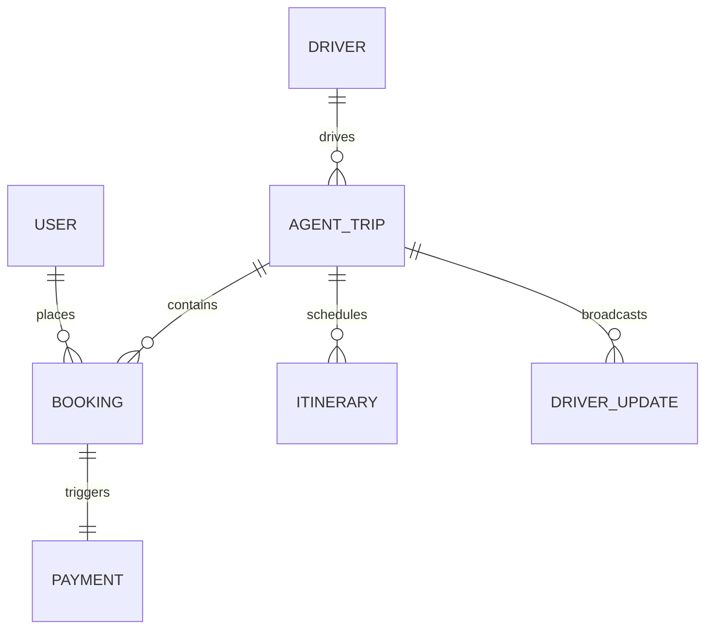

# Database Documentation — Traveloop V2

This document provides schema declarations and collection relationship diagrams for the Traveloop V2 MongoDB database layer.

---

## 1. Schema Relationships

---

## 2. Collection Schemas

### A. Users (`users`)
Stores profile credentials and gamification stats for traveler users.

| Field | Type | Description | Constraints |
| :--- | :--- | :--- | :--- |
| `_id` | ObjectId | Primary Key | Unique, Auto |
| `firstName` | String | Traveler first name | Required |
| `lastName` | String | Traveler last name | Required |
| `email` | String | Login email | Required, Unique, Lowercase |
| `password` | String | Bcrypt hash | Required |
| `phone` | String | Contact mobile | Required |
| `xp` | Number | Experience points | Default: 0 |
| `level` | Number | Level reached | Default: 1 |
| `streak` | Number | Active daily streak | Default: 0 |
| `createdAt` | Date | Creation timestamp | Auto |

---

### B. Agent Trips (`agenttrips`)
Defines the travel packages created by travel agencies.

| Field | Type | Description | Constraints |
| :--- | :--- | :--- | :--- |
| `_id` | ObjectId | Primary Key | Unique, Auto |
| `title` | String | Package Title | Required |
| `destination`| String | Destination location | Required |
| `startDate` | String | Travel start date (YYYY-MM-DD) | Required |
| `endDate` | String | Travel end date (YYYY-MM-DD)| Required |
| `driver` | ObjectId | Ref to assigned driver | Optional (Driver schema) |
| `boardingStatus`| String | Current boarding state | Enum: `CLOSED`, `OPEN`, `COMPLETED` |
| `boardingOpenedAt`| Date | Boarding start timestamp | Optional |
| `boardingClosedAt`| Date | Boarding end timestamp | Optional |
| `busNumber` | String | Bus registration plate | Optional |

---

### C. Bookings (`bookings`)
Records traveler purchases and boarding pass status details.

| Field | Type | Description | Constraints |
| :--- | :--- | :--- | :--- |
| `_id` | ObjectId | Primary Key | Unique, Auto |
| `bookingId` | String | Unique tracking code | Required |
| `userId` | ObjectId | Ref to Traveler User | Required |
| `agentTrip` | ObjectId | Ref to Agent Package | Required |
| `seats` | Number | Number of reserved seats | Default: 1 |
| `pricePaid` | Number | Total package price paid | Required |
| `paymentStatus` | String | Status of settlement | Enum: `Pending`, `Paid`, `Cancelled` |
| `boardingStatus`| String | Boarding verification state | Enum: `Pending`, `Checked-In`, `Boarded`, `No Show` |
| `assignedSeat` | String | Seat assignment number | Optional |
| `token` | String | Decrypted QR verification token | Unique |

---

### D. Driver Updates (`driverupdates`)
Maintains location coordinates and status alerts posted by assigned drivers.

| Field | Type | Description | Constraints |
| :--- | :--- | :--- | :--- |
| `_id` | ObjectId | Primary Key | Unique, Auto |
| `trip` | ObjectId | Ref to Agent Trip | Required |
| `driver` | ObjectId | Ref to Driver | Required |
| `driverName` | String | Display name of poster | Required |
| `type` | String | Update Type | Enum: `info`, `alert`, `delay`, `location`, `pickup` |
| `message` | String | Detailed update string | Required |
| `isDeleted` | Boolean | Soft delete flag | Default: false |
| `createdAt` | Date | Broadcast timestamp | Auto |

---

## 3. Database Indexes

To optimize query operations, the following indexes are declared:
1. `users.email` (Unique Hash Index)
2. `bookings.bookingId` (Unique String Index)
3. `bookings.userId` (Reference Index)
4. `agenttrips.driver` (Reference Index)
5. `driverupdates.trip` (Reference Index)
