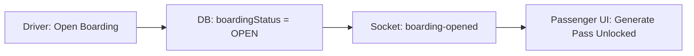

# Features Catalogue — Traveloop V2

This document provides a catalogue of the core functional features shipped in Traveloop V2.

---

## 1. Realtime Boarding Pass System

### Description
Prevents passengers from accessing their boarding QR codes until the driver officially opens the boarding window. Ensures complete coordinator control over departures.

* **Workflow**:
  1. Driver reviews assigned trips on their dashboard.
  2. Driver clicks "Open Boarding" to signal readiness.
  3. Backend updates DB status and broadcasts a websocket event.
  4. Passenger's "Generate Boarding Pass" button unlocks.
  5. Passenger clicks to generate a verified QR code token.
  6. Driver scans the QR code to verify check-in.
* **Inputs**: Driver credentials, booking confirmation tokens.
* **Outputs**: Boarding pass QR vector image, checked-in verification screen.
* **Edge Cases**:
  * *No internet connection during boarding*: The system supports offline pass rendering if the token was already cached.
  * *Passenger attempt to scan after boarding closed*: The scanner returns an "Expired Pass" red banner.

---

## 2. Trip Manifest Detail Page

### Description
An operational dashboard inside the Agent Portal for agencies to monitor departure progress, assign drivers, and check occupancy states.

* **Workflow**:
  1. Agency selects a scheduled trip.
  2. Manifest page displays summary card metrics (Total, Boarded, No-shows).
  3. Lists all booked passengers with age, phone number, payment details, and live boarding state.
  4. Renders buttons to Export PDF rosters, Download Excel sheets, or dispatch SMS alerts.
* **Inputs**: Trip ID parameters.
* **Outputs**: PDF manifest documents, Excel sheets, passenger detail grids.

---

## 3. Driver Updates Timeline

### Description
An announcement stream connecting the driver's phone directly to passengers' timeline feeds.

* **Workflow**:
  1. Driver opens the Dashboard, selects "Post Update".
  2. Selects update category: Info 📋, Alert ⚠️, Delay ⏰, or Location 📍.
  3. Types announcement and clicks Send.
  4. Backend publishes update and triggers client notifications.
* **Inputs**: Announcement type, message payload, coordinates (optional).
* **Outputs**: Timeline update cards rendered inside traveler dashboards.
