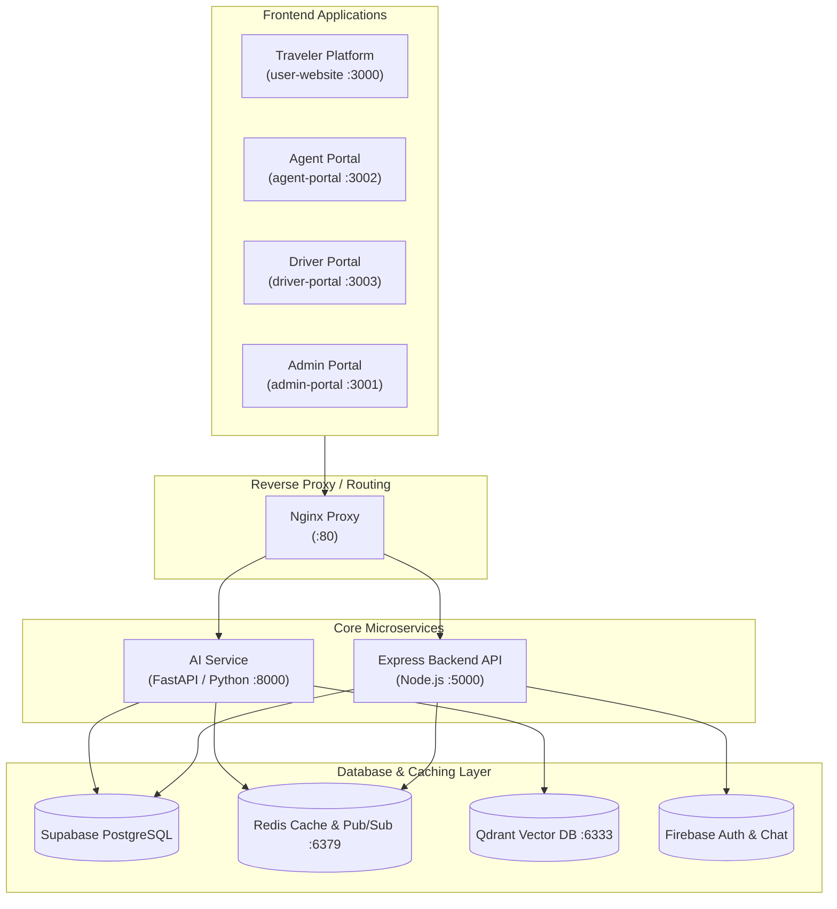

# 🌍 Traveloop V2 — AI-Powered Multi-Portal Travel Ecosystem

[](./docker-compose.yml)
[](./LICENSE)
[](./Backend)
[](./ai-service)
[](./user-website)

**Traveloop V2** is an enterprise-grade, end-to-end travel booking, agent operations, driver dispatch, and administrative management platform. Built with a modern microservices & multi-portal architecture, Traveloop leverages real-time WebSocket communication, Supabase PostgreSQL, Redis caching, Qdrant vector search, and Gemini AI to streamline travel discovery, booking, payments, seat reservations, and field operations.

---

## 🏛️ System Architecture



---

## 🧰 Technology Stack

### **Backend Microservices**
- **Node.js & Express**: Core REST APIs, WebSocket engine (Socket.io), authentication, payment orchestration.
- **Python & FastAPI**: AI assistant engine, semantic search, vector embeddings, itinerary personalization.

### **Databases & Storage**
- **Supabase (PostgreSQL)**: Primary relational store for users, bookings, trips, payments, and seats.
- **Redis**: Real-time seat lock cache, session states, and AI conversation memory.
- **Qdrant**: Vector database for AI travel recommendations and semantic search.
- **Firebase**: Phone OTP verification, Firebase Auth, and real-time chat sync.

### **Frontend Applications**
- **React 19 + Vite**: High-performance Single Page Applications (SPAs).
- **Tailwind CSS**: Modern custom design system with dark/light themes.
- **Framer Motion**: Smooth micro-animations and page transitions.

### **Integrations & Payments**
- **Razorpay**: Native UPI & card payment processing.
- **Google Maps API**: Distance matrix, place autocomplete, and live tracking.
- **Google Gemini 1.5/2.0**: Natural language trip recommendations and itinerary generation.

---

## 📁 Repository Structure

```
traveloop_V2/
├── Backend/                 # Express REST API & Socket.io server
├── ai-service/              # FastAPI Python service for AI & Vector search
├── user-website/            # Traveler Web Platform (Bookings, Explore, Account)
├── admin-portal/            # Platform Super-Admin Operations & Approvals
├── agent-portal/            # Tour Operator Dashboard (Trip Creation & Analytics)
├── driver-portal/           # Driver Field Operations & QR Ticket Scanner
├── nginx/                   # Reverse Proxy Configuration
├── project-resources/       # Shared assets, legal sites, and brand guides
├── docker-compose.yml       # Production Docker Multi-Container Configuration
├── .env.example             # Global environment template
└── README.md                # Documentation
```

---

## 👥 Multi-Portal Ecosystem

| Portal | Port | Target Audience | Primary Functionality |
| :--- | :--- | :--- | :--- |
| **User Website** | `:3000` | Travelers | Explore packages, select seats, book trips, Razorpay payments, download PDF passes, AI chat. |
| **Agent Portal** | `:3002` | Tour Agents | Create & publish trips, set seat layouts, manage pricing, view booking logs, slot analytics. |
| **Admin Portal** | `:3001` | System Admins | Approve/reject agent packages, oversee revenue, manage agent verification, platform metrics. |
| **Driver Portal** | `:3003` | Bus Drivers | Scan passenger QR boarding passes, mark attendance, transmit live location updates. |
| **AI Service** | `:8000` | Backend/AI | Semantic trip search, RAG-assisted travel recommendations, vector indexing. |
| **Express Backend** | `:5000` | Core API | User management, booking transactions, seat lock coordination, PDF generation. |

---

## 🚀 Quick Start with Docker (Recommended)

### **Prerequisites**
- [Docker Desktop](https://www.docker.com/products/docker-desktop/) (v24.0+)
- [Docker Compose](https://docs.docker.com/compose/) (v2.20+)

### **1. Clone & Configure Environment**
```bash
git clone https://github.com/your-org/traveloop_v2.git
cd traveloop_V2

# Copy template env files
cp .env.example .env
cp Backend/.env.example Backend/.env
cp ai-service/.env.example ai-service/.env
cp user-website/.env.example user-website/.env
```

### **2. Launch Services**
```bash
docker compose up --build -d
```

### **3. Verify Running Services**
```bash
docker compose ps
```
Access points:
- **Traveler App**: http://localhost:3000
- **Admin Portal**: http://localhost:3001
- **Agent Portal**: http://localhost:3002
- **Driver Portal**: http://localhost:3003
- **Backend Health**: http://localhost:5000/api/health
- **AI Service Health**: http://localhost:8000/health

---

## 💻 Local Development Setup (Without Docker)

### **1. Start Core Backend**
```bash
cd Backend
npm install
npm run dev
# Running on http://localhost:5000
```

### **2. Start AI Microservice**
```bash
cd ai-service
python -m venv .venv
# On Windows:
.venv\Scripts\activate
# On Linux/macOS:
source .venv/bin/activate

pip install -r requirements.txt
uvicorn app.main:app --reload --port 8000
```

### **3. Start Frontend Portals**
```bash
# Traveler Website
cd user-website && npm install && npm run dev

# Agent Portal
cd agent-portal && npm install && npm run dev

# Admin Portal
cd admin-portal && npm install && npm run dev

# Driver Portal
cd driver-portal && npm install && npm run dev
```

---

## ⚙️ Environment Variables Overview

| Service | Variable Name | Required | Description |
| :--- | :--- | :--- | :--- |
| **Backend** | `SUPABASE_URL` | Yes | Supabase PostgreSQL Endpoint |
| **Backend** | `SUPABASE_SERVICE_ROLE_KEY` | Yes | Supabase Administrative Service Key |
| **Backend** | `RAZORPAY_KEY_ID` | Yes | Razorpay API Key ID |
| **Backend** | `RAZORPAY_KEY_SECRET` | Yes | Razorpay API Secret |
| **Backend** | `REDIS_URL` | Yes | Redis Connection String |
| **AI Service** | `GEMINI_API_KEY` | Yes | Google Gemini API Key |
| **AI Service** | `QDRANT_URL` | Yes | Qdrant Vector Database Endpoint |
| **User Website**| `VITE_API_URL` | Yes | Backend REST API Base URL |

---

## 🔌 API Summary & Endpoints

### **Authentication & Profile**
- `POST /api/auth/register` — Register traveler user
- `POST /api/auth/login` — Login user & obtain JWT token
- `GET /api/profile` — Fetch user profile & loyalty points

### **Trips & Search**
- `GET /api/trips/published` — Browse live published trips (Traveler view)
- `GET /api/trips/:id` — Detailed trip view (Itinerary, inclusions, seat layout)
- `POST /api/agent/trips/create` — Agent creates new trip draft
- `POST /api/agent/trips/:id/publish` — Publish trip for admin approval

### **Bookings & Payments**
- `POST /api/seats/reserve` — Lock seats temporarily in Redis
- `POST /api/bookings/create-order` — Initialize Razorpay payment & draft booking
- `POST /api/payment/verify` — Verify Razorpay signature & confirm booking
- `GET /api/bookings/ticket/:bookingId` — Fetch confirmed pass details & QR code
- `GET /api/bookings/:bookingId/pdf` — Download PDF pass

### **Driver & Verification**
- `POST /api/driver/scan-qr` — Scan & validate passenger QR pass at bus entry

---

## 🔒 Security & Best Practices

1. **JWT & Role-Based Access Control**: Strict middleware verification for Travelers, Agents, Drivers, and Admins.
2. **Double-Query Fallback & Identifier Safety**: Safe UUID vs string identifier resolution preventing Postgres type coercion crashes.
3. **Optimistic & Pessimistic Seat Locking**: Redis memory locks prevent double-booking of identical seats during checkout.
4. **Environment Isolation**: No hardcoded API keys or service secrets in repository code.

---

## 📄 License

Distributed under the MIT License. See [`LICENSE`](./LICENSE) for full details.

---

## 🗺️ Roadmap & Future Enhancements

- [ ] Automated Multi-currency support.
- [ ] Offline PWA ticket caching for drivers in low-connectivity areas.
- [ ] Real-time GPS bus tracking integration on traveler maps.