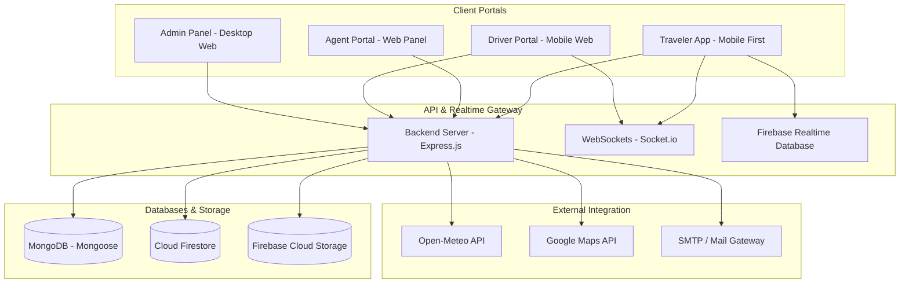
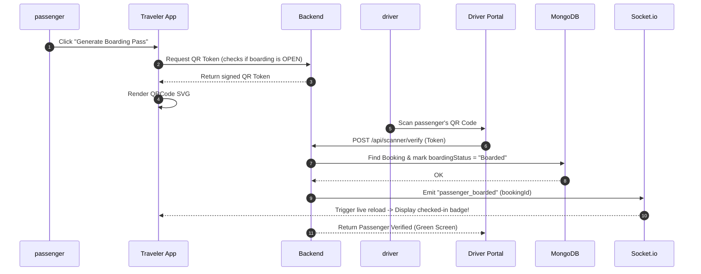

# System Architecture — Traveloop V2

This document provides a detailed breakdown of the Traveloop V2 architecture, including system flows, module specifications, and technology topologies.

---

## 1. Architectural Overview

Traveloop V2 is built on a **Modular Micro-Frontend and Unified API Gateway** model, designed to support real-time data sync across travelers, drivers, agencies, and system admins.

---

## 2. Component Explanations

### A. Client Portals (Micro-Frontends)
1. **Traveler Portal (`traveloop`)**: Mobile-first Web/PWA interface built using React, React Router, and TailwindCSS. Manages client-side state, packing lists, expense sheets, private journals, and displays live boarding QR passes.
2. **Agent Portal (`agent-portal`)**: Desktop web dashboard for package listings, calendar management, and passenger roster detail sheets.
3. **Driver Portal (`driver-portal`)**: Real-time interface for dispatch operations, allowing driver check-ins, boarding window switches (Open/Close Boarding), and QR scanning logic.
4. **Admin Portal (`admin-portal`)**: System setting configuration and system analytics monitoring.

### B. Communication & State Synchronization Layer
* **REST API**: Serves JSON payloads for transactional actions (Register, Login, Booking, Payment).
* **Socket.io (WebSockets)**: Handles event-driven updates. Emmits events such as `boarding-opened`, `passenger_boarded`, and `driver-update-posted` for zero-refresh UI updates.
* **Firebase SDK (Firestore & Realtime Database)**: Backs real-time features like the package group chats, user presence, and typing status indicators.

---

## 3. Realtime Boarding Event Sequence

This diagram details the sequence of a passenger boarding verification flow from the driver portal through the system databases to the traveler app:

---

## 4. Deployment Topology

The production architecture separates stateless servers from storage clusters to optimize scalability:

* **Frontend Portals**: Managed and served globally via Vercel Edge networks.
* **Backend API Server**: Node.js app instance hosted on AWS ECS / Render with PM2 process monitors.
* **MongoDB**: Multi-region MongoDB Atlas cluster.
* **Realtime Services**: Google Firebase Firestore and Realtime Database cloud nodes.
