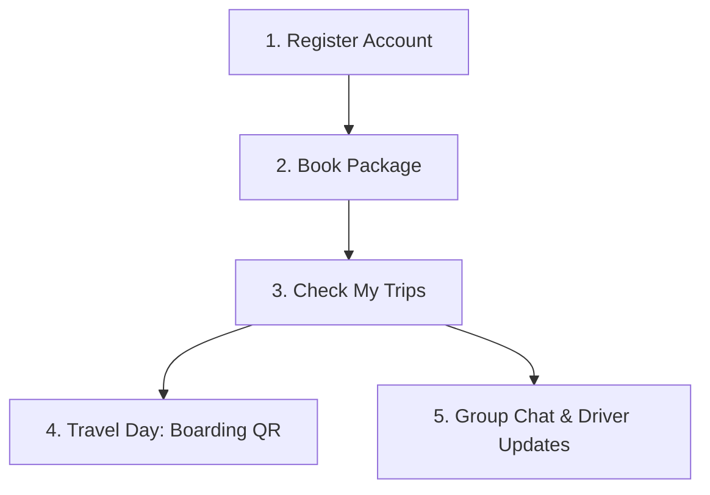

# User Guide — Traveloop V2

This guide outlines user flows and portal highlights for travelers, agencies, and drivers.

---

## 1. Traveler User Guide

Welcome to your personal travel workspace!

### Key Actions
* **Check My Trips**: Upon booking a package through an agency, it will automatically populate under your **My Trips** tab.
* **Review Itinerary & Inclusions**: Open the package details card to check hotel bookings, meals included (Breakfast, Lunch, Dinner), transport bus numbers, and your assigned seat.
* **Join Group Chat**: Switch to the **Group Chat** tab to message other travelers, the trip organizer, and your driver.
* **Receive Driver Announcements**: Go to the **Driver Updates** tab to monitor live alerts regarding delays, pickup platforms, or route updates.
* **Generate Boarding Pass**: On departure day, once your driver opens the boarding gate, click "Generate Boarding Pass" to render your QR code. Show this to the driver for validation.

---

## 2. Agent User Guide

Manage bookings, schedules, and driver assignments.

### Key Actions
* **Create Trip Packages**: Set start/end dates, base prices, seat capacities, hotel ratings, and drop-off points.
* **Assign Drivers**: Search for existing drivers via email (e.g., `visionxnxtgen2026@gmail.com`) to assign them to departures. The driver is immediately notified and the trip shows on their portal dashboard.
* **Monitor Manifests**: Check real-time passenger counts, verify payment completions, and view checked-in passenger rosters.

---

## 3. Driver User Guide

Operate departures, verify check-ins, and broadcast travel alerts.

### Key Actions
* **Open Boarding**: Upon arriving at the pickup location, open your Dashboard and click "Open Boarding". This triggers pass activation for your passengers.
* **Verify Boarding passes**: Click "Scan QR" to open your device camera. Align with passenger boarding passes. Successful scans update passenger check-in states to "Boarded" automatically.
* **Broadcast Alerts**: Use the "Post Update" modal to send instant delays or platform notifications to all travelers.
